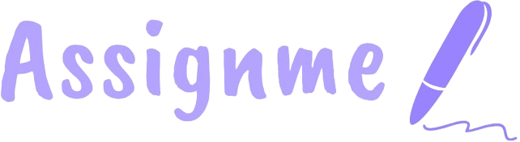
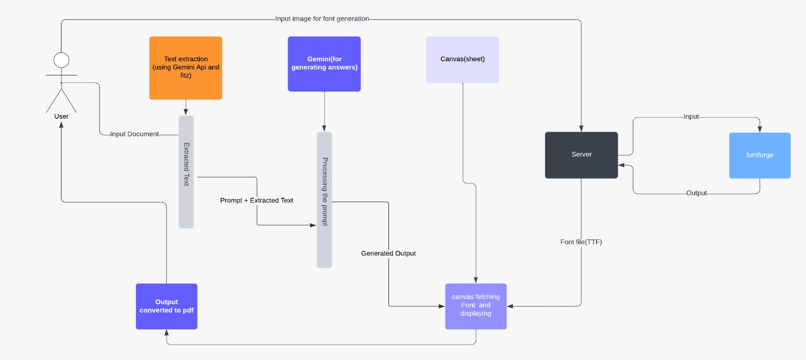

# AssignMe - Complete Your Assignments with Custom Handwriting

AssignMe is an open source web application that helps students complete their assignments by converting digital text into customizable handwritten-style documents. The application provides two main features: generating handwritten-style documents from text and creating custom handwriting fonts from your own handwriting samples. You just need to upload your assignment question and wait for the magic.




## 🛡️ Open Source

This project is open source and released under the [MIT License](./LICENSE). You are free to use, modify, and distribute this software. Contributions are welcome!

## 🌟 Features

### 1. Assignment Text to Handwriting Converter
- Upload assignment questions (PDF or image)
- Enter subject name for better processing
- Customize handwriting style with various font options
- Adjust text parameters (font size, spacing, position)
- Apply different paper effects (shadows, scanner look)
- Choose pen color (blue, black, red, green)
- Generate and download handwritten documents as images or PDF

### 2. Custom Handwriting Font Generator
- Create your own handwriting font
- Capture handwriting samples from camera or uploaded images
- Follow guidelines for best results
- Use your custom font in the handwriting generator

### 3. AI-Powered Q&A System
- Intelligent question processing using Google Gemini AI
- Contextual understanding of assignment questions
- Enhanced text extraction and processing capabilities

### 4. Advanced Font Processing Backend
- Server-side FontForge integration for professional font generation
- Dockerized backend service for scalable font processing
- High-quality font rendering and optimization

## 🖼️ System Architecture



This was early prototype system architecture that laid the solid foundation for the platform. Load balancing and bottleneck handling architecture designs are not included in this diagram, as they were implemented during the hosting phase.

## 🚀 Getting Started

You can access the live version of the application at [assignme.live](https://assignme.live) or set up a local development environment following the instructions below.

### Prerequisites
- Modern web browser (Chrome, Firefox, Edge recommended)
- Internet connection
- For backend services: Docker (optional)
- Python 3.8+ (for AI services)

### Installation
1. Clone the repository:
   ```
   git clone https://github.com/yourusername/assignme.git
   ```
2. Navigate to the project directory:
   ```
   cd assignme
   ```

3. Open the project:
   * Simply open `index.html` in your web browser
   * No build process or server setup required
   
For local development, you can use a simple HTTP server:
   ```
   # Using Python (Python 3)
   python -m http.server
   
   # OR using VS Code Live Server extension
   # Right-click on index.html and select "Open with Live Server"
   ```

### Backend Services Setup (Optional)

#### FontForge Backend Service
For advanced font processing capabilities:

1. Navigate to the fontforge backend directory:
   ```
   cd fontforge_backend
   ```

2. Build and run with Docker:
   ```
   docker build -t assignme-fontforge .
   docker run -p 5000:5000 assignme-fontforge
   ```

3. The FontForge backend will be available at `http://localhost:5000`

#### Gemini Q&A Service
For AI-powered question processing:

1. Navigate to the Q&A directory:
   ```
   cd "q&a gemini"
   ```

2. Install dependencies:
   ```
   pip install -r requirements.txt
   ```

3. Set up your Google Gemini API key in environment variables

4. Run the service:
   ```
   python main.py
   ```

**Note:** While this is a static web application that runs in the browser, the backend services provide enhanced functionality for font generation and AI processing.

5. You're ready to go! The application will automatically use the correct configuration based on your environment.

## 📚 Usage

### Converting Text to Handwriting
1. Open the home page (`index.html`)
2. Upload your assignment question file (PDF/image)
3. Enter the subject name
4. Click "Upload" to process your assignment
5. Customize handwriting options (font, size, spacing, color)
6. Optionally upload a custom paper background image for different paper textures
7. Click "Generate Sheet" to create your handwritten document
8. Download the result as a PDF or individual images

### Creating Your Own Handwriting Font
1. Navigate to "Own Handwriting" section
2. Follow the capture guidelines (stay in the box, align with grid, use black pen)
3. Either capture handwriting samples with your camera or upload images
4. Submit samples to generate your custom font
5. Use your new font in the main handwriting generator

## 🔧 Customization Options

### Handwriting Options
- **Font Selection**: Choose from 30+ handwriting styles
- **Font Size**: Adjust from small to large (up to 30pt)
- **Upload Custom Font**: Add your own TTF/OTF font files
- **Vertical Position**: Adjust text positioning on page
- **Word Spacing**: Control space between words (0-100px)
- **Letter Spacing**: Adjust space between letters (-5 to 40pt)
- **Effects**: Apply shadow, scanner, or no effect
- **Custom Paper Background**: Upload your own paper texture or background image
- **Pen Color**: Choose between blue, black, red, or green ink

## 📂 Project Structure

```
assignme/
│
├── index.html            # Main application page
├── docs.html             # Documentation and guide
├── contactus.html        # Feedback form
├── style.css             # Main stylesheet
├── .gitignore            # Git ignore configuration
├── .env                  # Environment variables (not tracked in git)
├── .env.example          # Example environment variables template
│
├── js/                   # JavaScript files
│   ├── script.js         # Main script file
│   └── config.js         # Configuration and environment variables loader
│
├── canvaPage/            # Canvas drawing functionality
│   ├── css/              # Canvas page stylesheets
│   │   ├── features.css  # Feature-specific styles
│   │   └── index.css     # Canvas page main styles
│   │
│   ├── js/               # Canvas page scripts
│   │   ├── app.mjs       # Main application script
│   │   ├── generate-images.mjs  # Image generation functionality
│   │   └── utils/        # Utility functions
│   │       ├── draw.mjs  # Drawing functions
│   │       ├── generate-utils.mjs  # Generation utilities
│   │       └── helpers.mjs  # Helper functions
│   │
│   ├── fonts/            # Custom and generated fonts
│   └── cypress.json      # Cypress testing configuration
│
├── captureimg/           # Custom handwriting capture functionality
│   ├── index.html        # Handwriting capture page
│   ├── scripts.js        # Capture functionality
│   └── style.css         # Capture page styles
│
├── fontforge_backend/    # FontForge backend service
│   ├── app.py            # Flask application for font processing
│   ├── Dockerfile        # Docker configuration for containerization
│   └── requirements.txt  # Python dependencies (inferred)
│
├── q&a gemini/           # AI-powered Q&A service
│   ├── main.py           # Main application script for Gemini integration
│   ├── requirements.txt  # Python dependencies for AI service
│   └── config/           # Configuration files (inferred)
│
├── image/                # Website images
│   ├── logo.png          # Site logo
│   ├── icon.png          # Favicon
│   ├── docs/             # Documentation images
│   └── ...               # Other site images
│
└── script/               # Additional scripts and resources
    ├── package.json      # Package configuration (not for main app)
    ├── test.js           # Testing script
    └── images/           # Sample images for font generation
```

## 🏗️ Architecture Overview

### Frontend Components
- **Main Application**: Static HTML/CSS/JS application running in browser
- **Canvas Page**: Interactive handwriting generation interface
- **Capture Interface**: Handwriting sample collection system

### Backend Services
- **FontForge Backend**: Dockerized Python service using FontForge for professional font generation
- **Gemini Q&A Service**: AI-powered question processing using Google's Gemini API
- **File Processing API**: Handles document upload and text extraction

### Key Features
- **Client-Side Processing**: Most functionality runs directly in the browser
- **Scalable Backend**: Optional backend services for enhanced capabilities
- **AI Integration**: Gemini AI for intelligent question understanding
- **Professional Font Generation**: FontForge integration for high-quality custom fonts

## 🔄 API Integration

The application integrates with multiple backend services:

### Main File Processing API
```javascript
const url = "https://test2-sfwm.onrender.com/process-file/";

function uploadFile() {
  // File upload and processing functionality
  // ...
  axios.post(url, formData, {
    headers: {
      'Content-Type': 'multipart/form-data'
    },
  })
  .then(function (response) {
    // Process and display response
  })
  .catch(function (error) {
    console.error("Error:", error);
  });
}
```

### FontForge Backend API
```javascript
// Font generation endpoint
const fontForgeUrl = "http://localhost:5000/generate-font/";

// Custom font processing
function processHandwritingFont(samples) {
  // Send handwriting samples to FontForge backend
  // Returns processed font file
}
```

### Gemini Q&A API
```javascript
// AI question processing
const geminiUrl = "http://localhost:8000/process-question/";

// Intelligent question analysis
function analyzeQuestion(questionText, subject) {
  // Leverages Gemini AI for enhanced understanding
  // Returns structured question data
}
```

> **Note:** The provided API endpoints are for testing and demonstration purposes only. They are not intended for production use.

## 🐳 Docker Deployment

### FontForge Backend
```bash
# Build the FontForge service
cd fontforge_backend
docker build -t assignme-fontforge .

# Run the service
docker run -d -p 5000:5000 --name fontforge-service assignme-fontforge
```

### Complete Stack with Docker Compose
```yaml
version: '3.8'
services:
  fontforge-backend:
    build: ./fontforge_backend
    ports:
      - "5000:5000"
    
  gemini-qa:
    build: ./q&a\ gemini
    ports:
      - "8000:8000"
    environment:
      - GEMINI_API_KEY=${GEMINI_API_KEY}
```

## 🤖 AI Features

### Gemini Integration
The Q&A Gemini service provides:
- **Question Understanding**: Context-aware processing of assignment questions
- **Subject Recognition**: Automatic subject classification and relevant processing
- **Content Enhancement**: Improved text extraction from images and PDFs
- **Language Support**: Multi-language question processing capabilities

### Setup Requirements
1. Google Gemini API key
2. Python 3.8+
3. Required dependencies (see `q&a gemini/requirements.txt`)

## 🤝 Contributing

Contributions are welcome! Please feel free to submit a Pull Request.

1. Fork the repository
2. Create your feature branch (`git checkout -b feature/amazing-feature`)
3. Commit your changes (`git commit -m 'Add some amazing feature'`)
4. Push to the branch (`git push origin feature/amazing-feature`)
5. Open a Pull Request

### Development Areas
- **Frontend Enhancements**: Improve UI/UX and add new features
- **Backend Services**: Enhance AI processing and font generation
- **API Integration**: Develop new backend service integrations
- **Documentation**: Improve guides and examples

## 📝 License

This project is available under the MIT License. See the LICENSE file for more information.

## 👥 Acknowledgments

- References: GitHub, Node community, GenAI, Open-source
- Fonts used in this project are either created by the team or sourced from open-source font repositories
- HTML2Canvas for converting HTML to images
- jsPDF for PDF generation
- **FontForge**: Open-source font editor for professional font generation
- **Google Gemini**: AI-powered question processing and understanding
- **Docker**: Containerization for scalable backend services

## 📧 Contact

Rajan  Bhai (link  availble hai har  jagha )

---


